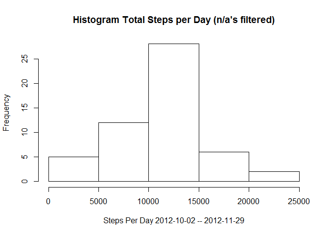
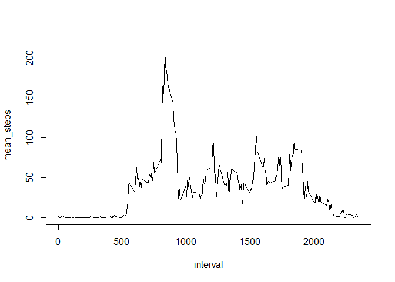
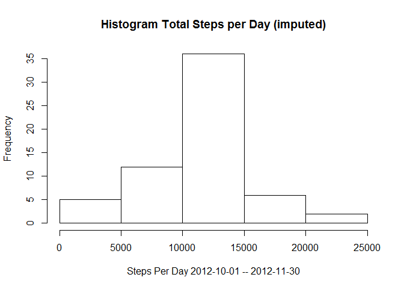

# Reproducible Research: Peer Assessment 1
Note: Apologizes but found at the last minute that when viewed from github some text chunks are given a
gray background. This makes distinguishing code from comments a bit confusing further down. Don't think 
i can fix this by the project deadline since i'm not sure what's causing it.

## Loading and preprocessing the data
Load helper libraries, filtering out the method override noise

```r
    suppressPackageStartupMessages( library(dplyr) )
    suppressPackageStartupMessages( library(data.table) )
    suppressPackageStartupMessages( library(lattice) )
```

Unzip and load the data into a data.table, coerse the date column to a date during the load

```r
    setClass("date"); setAs("character", "date", function(from) as.Date( from, format="%Y-%m-%d"))
    data_set<-data.table( read.csv( unz("activity.zip", "activity.csv"), colClasses=c('integer','date','integer') ))
```


## What is mean total number of steps taken per day?
For this part of the assignment, you can ignore the missing values in the dataset.<br>
[Note: this will eliminate days which have no non-na intervals for this section]

```r
    no_nas <- filter( data_set, !is.na(steps ) )
```

Calculate the total number of steps taken each day. 

```r
# create a function, also need for imputed section of the assignment
    tot_steps<-function(x){ group_by(x,date) %>% summarize(total_steps=sum(steps))} 
    steps_per_day <- tot_steps(no_nas);
```

Make a histogram of the total number of steps taken each day

```r
# create a function, also need for imputed section of the assignment
    hist_steps<-function(x,setname) {
        hist(x$total_steps,
            xlab = sprintf( "Steps Per Day %s -- %s", min(x$date),max(x$date)),
            main = sprintf( "Histogram Total Steps per Day (%s)", setname ))
        }
    hist_steps( steps_per_day, "n/a's filtered")
```

 

Calculate and report the mean and median of the total number of steps taken per day.
Per the discussion board this is interpreted as the mean/median across all steps/day


```r
# create a function, also need for imputed section of the assignment
    mm_steps_per_day<-function(x) { list( mean=mean(x$total_steps), median=median(x$total_steps))}
    mm_nasfiltered<-mm_steps_per_day(steps_per_day)
    cat( "Total steps per day, Mean:", mm_nasfiltered$mean, "Median:", mm_nasfiltered$median) 
```

```
## Total steps per day, Mean: 10766.19 Median: 10765
```

## What is the average daily activity pattern?

    Make a time series plot (i.e. type = "l") of the 5-minute interval (x-axis) and the average 
    number of steps taken, averaged across all days (y-axis)
    

```r
    avg_steps_interval <- no_nas %>% group_by(interval) %>% summarize( mean_steps = mean(steps))
    with( avg_steps_interval, plot(interval, mean_steps,type='l'))
```

 

    Which 5-minute interval, on average across all the days in the dataset, contains the 
    maximum number of steps?
    

```r
    max_interval<-avg_steps_interval[which.max(avg_steps_interval$mean_steps)]
    print (sprintf( "On average across all days the max number of steps (%d) occurs at the %d interval, which is %d minutes into the day",
    round(max_interval$mean_steps), 
    max_interval$interval,
    max_interval$interval * 5 ))
```

```
## [1] "On average across all days the max number of steps (206) occurs at the 835 interval, which is 4175 minutes into the day"
```


## Imputing missing values
Note that there are a number of days/intervals where there are missing values (coded as NA). The presence of missing days may introduce bias into some calculations or summaries of the data. Calculate and report the 
total number of missing values in the dataset (i.e. the total number of rows with NAs)


```r
    cat( sum( !complete.cases(data_set) ), "entries are missing a value for steps")
```

```
## 2304 entries are missing a value for steps
```

    Devise a strategy for filling in all of the missing values in the dataset.
First we'll quantify the na distribution to determine a reasonable strategy.


```r
    rows_per_day <- nrow(avg_steps_interval)
    number_days <- length(unique(data_set$date))
    nas_per_day<- group_by(data_set,date) %>% summarize( nacount= sum(is.na(steps))) %>% filter(nacount>0)
    nas_per_day
```

```
## Source: local data table [8 x 2]
## 
##         date nacount
## 1 2012-10-01     288
## 2 2012-10-08     288
## 3 2012-11-01     288
## 4 2012-11-04     288
## 5 2012-11-09     288
## 6 2012-11-10     288
## 7 2012-11-14     288
## 8 2012-11-30     288
```

```r
    print (sprintf( "%d out of %d days are missing a step entry (%f%%)",
         nrow(nas_per_day), number_days, nrow(nas_per_day)*100/number_days));
```

```
## [1] "8 out of 61 days are missing a step entry (13.114754%)"
```

```r
    weekdays(nas_per_day$date)
```

```
## [1] "Monday"    "Monday"    "Thursday"  "Sunday"    "Friday"    "Saturday" 
## [7] "Wednesday" "Friday"
```
The results indicate that only complete days are missing and that the day of week is relatively random. A reasonable approach will be filling in the missing na's by a mean of the intervals across all days. The effect of filling in the nas is expected to be minimal.


```r
    fillvals<-rep(avg_steps_interval$mean_steps, times=nrow(data_set)/nrow(avg_steps_interval))
    imputed<-data_set
    indices<-which(is.na(imputed$step))
    imputed$steps[indices]<-fillvals[indices]
```

    Make a histogram of the total number of steps taken each day.
    Calculate and report the mean and median total number of steps taken per day. 
    Do these values differ from the estimates from the first part of the assignment? 
    What is the impact of imputing missing data on the estimates of the total daily number of steps?

```r
    imputed_steps<-tot_steps(imputed)
    hist_steps( imputed_steps, "imputed" )
```

 

```r
    mm_imputed<-mm_steps_per_day(imputed_steps)
    cat( "Total steps per day (imputed), Mean:", mm_nasfiltered$mean, "Median:", mm_nasfiltered$median) 
```

```
## Total steps per day (imputed), Mean: 10766.19 Median: 10765
```

```r
    cat( "NA's filtered vrs imputed delta, mean:",
         mm_nasfiltered$mean-mm_imputed$mean,
         "median:",
         mm_nasfiltered$median-mm_imputed$median
         )
```

```
## NA's filtered vrs imputed delta, mean: 0 median: -1.188679
```


## Are there differences in activity patterns between weekdays and weekends?
Are there differences in activity patterns between weekdays and weekends?
For this part the weekdays() function may be of some help here. Use the dataset with the filled-in missing values for this part.
    Create a new factor variable in the dataset with two levels - "weekday" and "weekend" indicating whether a given date is a weekday or weekend day.

```r
    imputed<-mutate(imputed, weekend=as.factor(grepl("^S", weekdays(date) )))
    imputed<-mutate(imputed, isweekend = factor(weekend,labels=c("weekday","weekend")))
```
    Make a panel plot containing a time series plot (i.e. type = "l") of the 5-minute interval (x-axis) 
    and the average number of steps taken, averaged across all weekday days or weekend days (y-axis). 
    See the README file in the GitHub repository to see an example of what this plot should look like 
    using simulated data.

```r
# setnames(int_avg_steps, c("interval","weekday","weekend"))
    avg_step_daytype <- aggregate( steps ~ interval+isweekend,data<-imputed,mean)
    xyplot( steps ~ interval | isweekend, avg_step_daytype, 
            type="l",
            layout=c(1,2),
            xlab="Interval",
            ylab="Number of steps")
```

 
\
